# Orchid V2: Product Manager's Guide

A comprehensive walkthrough of the idea-to-execution pipeline in Orchid V2.

---

## Table of Contents

1. [Overview: The PM Workflow](#overview-the-pm-workflow)
2. [Starting a New Project](#starting-a-new-project)
3. [The Discussion Phase](#the-discussion-phase)
4. [Reviewing Requirements and Architecture](#reviewing-requirements-and-architecture)
5. [Approving the Plan](#approving-the-plan)
6. [Monitoring Execution](#monitoring-execution)
7. [Understanding Task Statuses](#understanding-task-statuses)
8. [Mobile Monitoring with Telegram and Slack](#mobile-monitoring-with-telegram-and-slack)
9. [Reading Milestone Summaries](#reading-milestone-summaries)
10. [Configuring Fully-Local Operation](#configuring-fully-local-operation)
11. [Glossary of Terms](#glossary-of-terms)

---

## Overview: The PM Workflow

Orchid V2 transforms how you manage software projects by combining AI-powered planning with real-time execution monitoring. The workflow follows five distinct phases:

### The Five Phases

1. **Discussion** — Chat with the AI Product Manager to refine your idea
2. **Requirements** — Review the automatically generated REQUIREMENTS.md
3. **Planning** — Review the automatically generated ARCHITECTURE.md and task breakdown
4. **Execution** — Watch AI agents build your project with real-time monitoring
5. **Review** — Read milestone summaries and approve progress

Each phase builds on the previous one, ensuring nothing gets missed from initial idea to finished product.

---

## Starting a New Project

### Using the New Project Wizard

The Web UI provides an intuitive wizard to get your project started:

1. Open the Orchid Web UI in your browser
2. Click the **"New Project"** button in the sidebar
3. Fill in the project details:
   - **Project Name** — A short, descriptive name
   - **Description** — What you want to build
   - **Project Type** — Choose from: AI Tool, Web App, CLI Tool, Game, or Other
4. Click **"Create Project"**

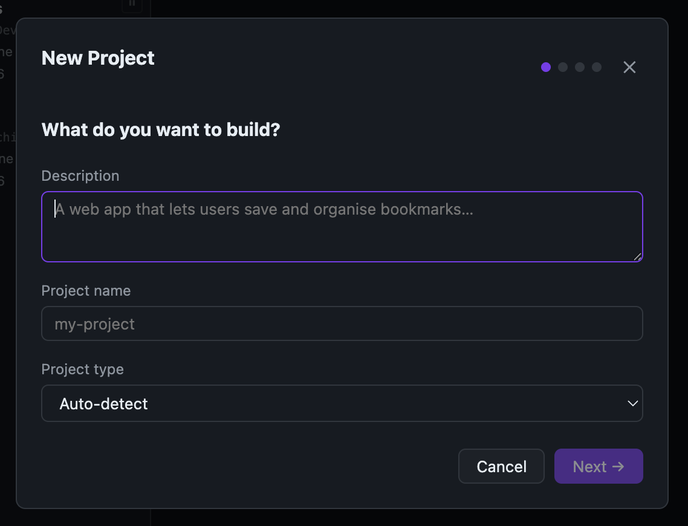

The wizard will:
- Create the project directory structure
- Initialize the tasks.md file with your first task
- Set up the .orchid.yaml configuration
- Open the Discussion tab ready for your first conversation

### What Happens Behind the Scenes

When you create a project, Orchid sets up:
- A `tasks.md` file to track all work items
- A `.orchid/` directory for internal state
- An empty `.orchid.yaml` for project-specific settings
- The Web UI connection to start monitoring

---

## The Discussion Phase

### Chatting with Your AI Product Manager

The Discussion tab is where you refine your idea through conversation:

1. Navigate to the **Planning** tab in the Web UI
2. Select the **Discussion** sub-tab
3. Start typing your project idea in the chat input
4. The AI PM will ask clarifying questions and suggest improvements

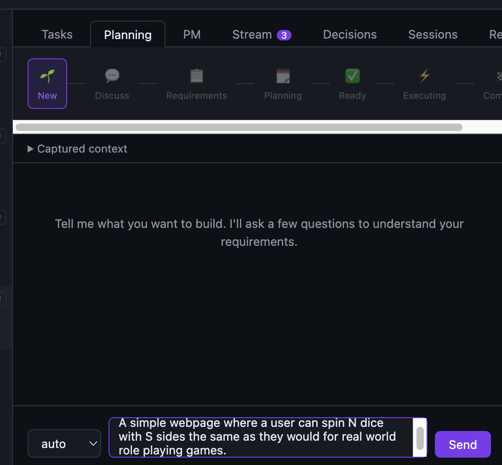

### Tips for Effective Discussions

**Be Specific**
- Instead of "I want a todo app," try "I want a todo app with user accounts, due dates, and email reminders"

**Iterate**
- The AI will suggest refinements — embrace them!
- You can go back and forth as many times as needed

**Use "done" When Ready**
- When you're satisfied with the discussion, type `done`
- The AI will generate REQUIREMENTS.md and ARCHITECTURE.md automatically

### What Happens During Discussion

The AI Product Manager will:
- Ask about features and priorities
- Suggest technical approaches
- Identify potential challenges
- Clarify edge cases
- Build a shared understanding of what you want to build

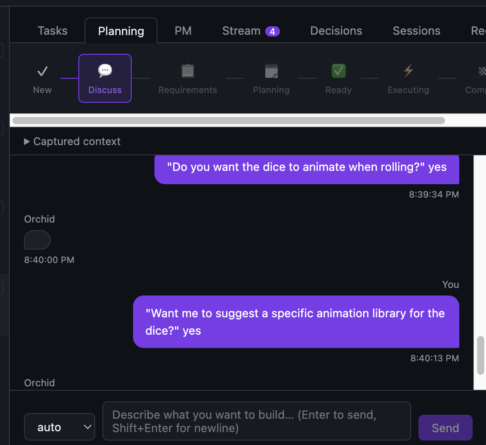
---

## Reviewing Requirements and Architecture

### After Typing "done"

Once you signal you're ready, Orchid generates two critical documents:

1. **REQUIREMENTS.md** — Detailed feature specifications
2. **ARCHITECTURE.md** — Technical design and component structure

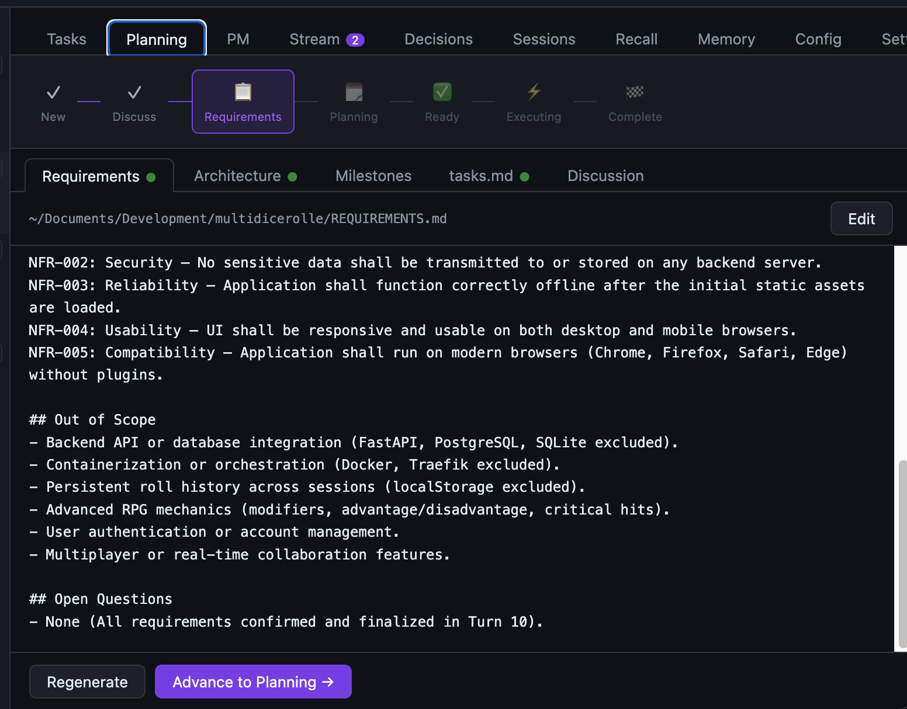

### The Requirements Document

REQUIREMENTS.md contains:
- **User Stories** — What users will be able to do
- **Functional Requirements** — Specific features and behaviors
- **Non-Functional Requirements** — Performance, security, scalability
- **Acceptance Criteria** — How we know each requirement is met

**What to Look For:**
- Are all your features included?
- Are any requirements unclear or missing?
- Do the acceptance criteria match your expectations?

### The Architecture Document

ARCHITECTURE.md contains:
- **System Overview** — High-level design
- **Component Diagram** — How parts fit together
- **Technology Stack** — Languages, frameworks, and tools
- **Data Models** — Key data structures
- **API Design** — If applicable

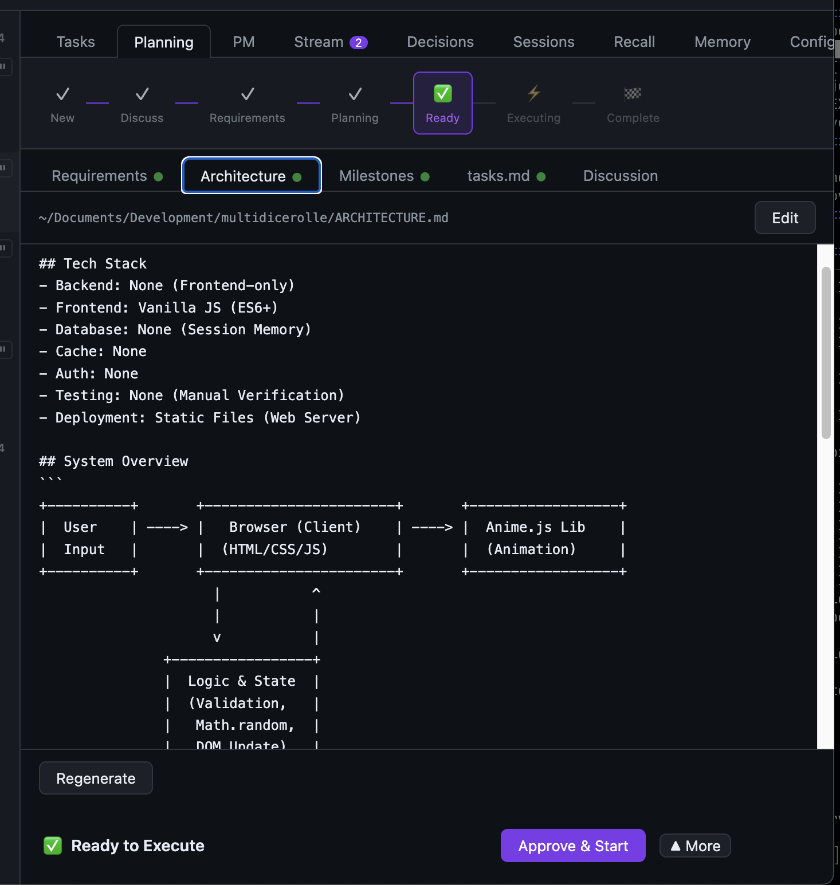

**What to Look For:**
- Does the approach make sense?
- Are the technology choices appropriate?
- Are there any obvious gaps or risks?

### The Tasks Breakdown

Orchid also generates a detailed task list in `tasks.md`:
- Each task has a unique ID (e.g., T001, T002)
- Tasks are organized by milestone
- Dependencies between tasks are clearly marked
- Priority levels help with sequencing

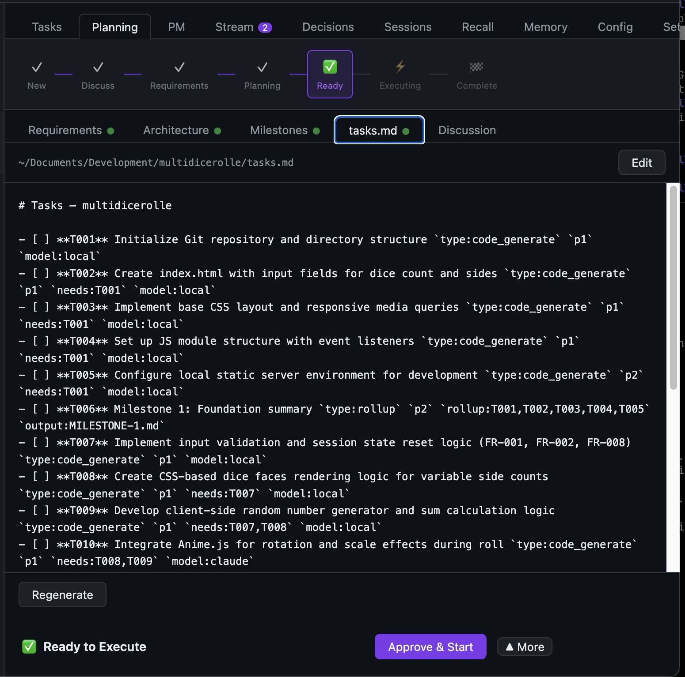
---

## Approving the Plan

### Moving to Execution

Once you've reviewed the documents and are satisfied:

1. Navigate to the **Approval** sub-tab in the Planning tab
2. Review the summary of what will be built
3. Click **"Approve and Start Execution"**

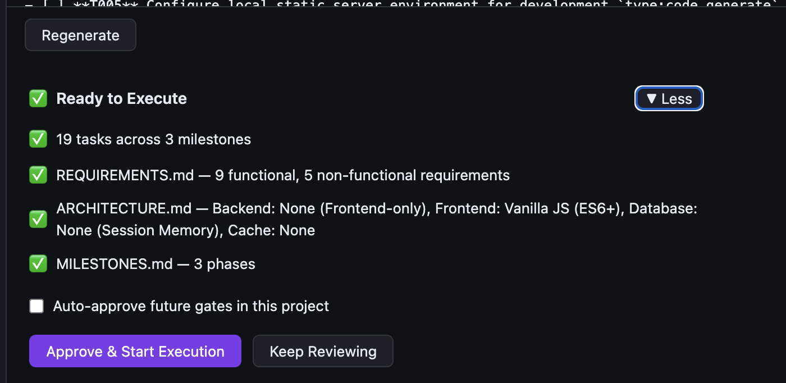

### What Approval Means

By approving, you confirm:
- ✅ Requirements are complete and accurate
- ✅ Architecture is sound
- ✅ Task breakdown is reasonable
- ✅ You're ready to start building

### What Happens After Approval

The project phase changes from **PLANNING** to **EXECUTING**:
- AI agents begin working on tasks automatically
- The Execution tab becomes active
- Real-time progress tracking starts
- You can monitor via Web UI, Telegram, or Slack

---

## Monitoring Execution

### The PM Dashboard

Once execution begins, the PM Dashboard gives you real-time visibility:

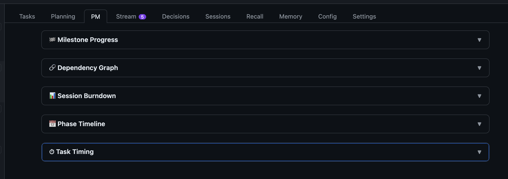

### 1. Milestone Progress

Shows completion percentage for each milestone:
- Visual progress bars
- Tasks completed vs. total per milestone
- Estimated time to completion

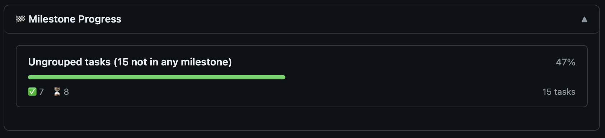

**What It Tells You:**
- Which milestones are on track
- Which milestones need attention
- Overall project completion percentage

### 2. Dependency Graph

Visualizes task dependencies:
- Nodes represent tasks
- Arrows show dependencies
- Color-coded by status
- Blocked tasks are highlighted

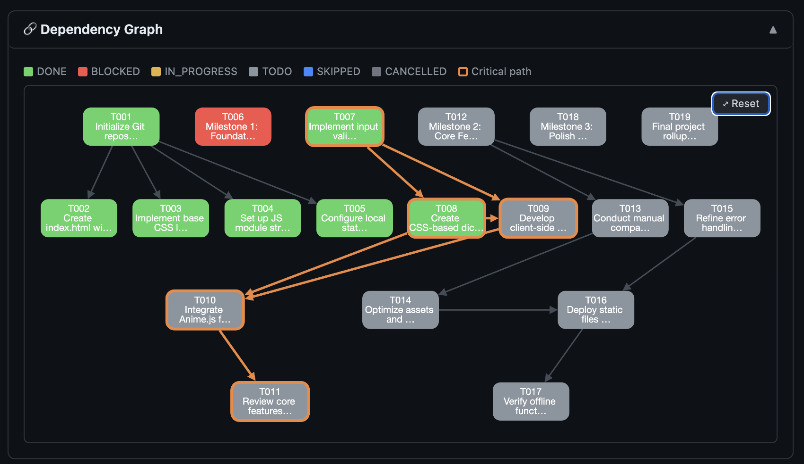

**What It Tells You:**
- Which tasks are blocking others
- Critical path items
- Where bottlenecks might occur

### 3. Session Burndown

Tracks work completed over time:
- Tasks completed per session
- Comparison to ideal burndown
- Velocity trends

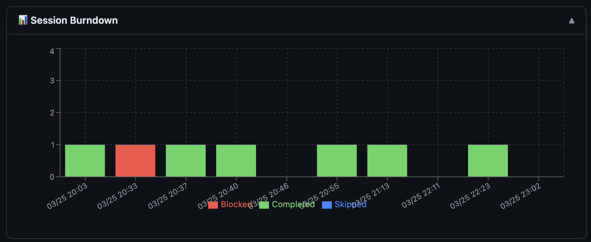

**What It Tells You:**
- Whether the project is on schedule
- Team (AI agent) velocity
- If adjustments are needed

### 4. Task Timing

Shows how long tasks take:
- Average time per task type
- Outliers (very fast or very slow tasks)
- Historical trends

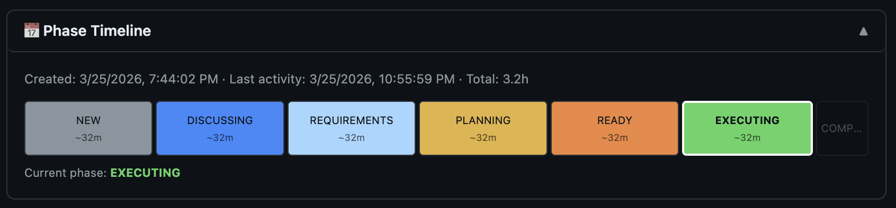

**What It Tells You:**
- Which task types take longest
- If tasks are taking longer than expected
- Where to focus optimization

### The Task Board

The Execution tab also shows a detailed task board:

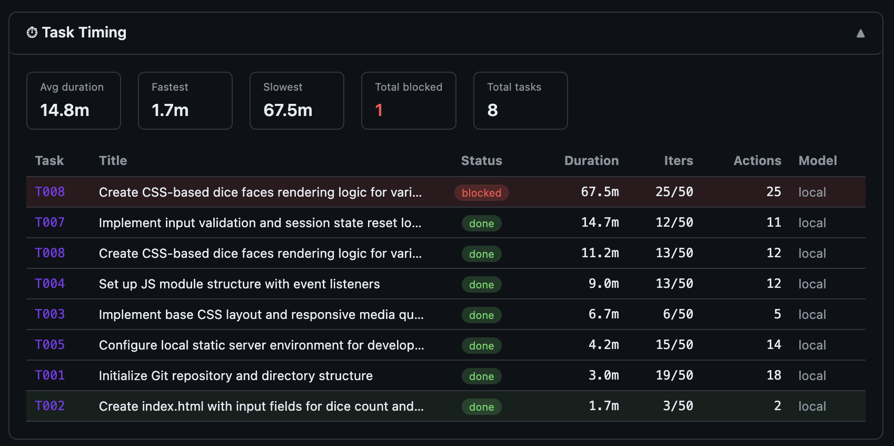

**Features:**
- Drag-and-drop status changes
- Click tasks to see details
- Filter by status, milestone, or priority
- Run individual tasks with the ▶ button

---

## Understanding Task Statuses

Tasks move through several statuses during execution:

### TODO `[ ]`

**Meaning:** Task is queued and waiting to be worked on

**When It Happens:**
- Task is created but not started
- All dependencies are satisfied
- Waiting for an available agent

**What You Can Do:**
- Nothing — wait for execution to begin
- Skip the task if it's no longer needed

### IN_PROGRESS `[>]`

**Meaning:** Task is currently being worked on

**When It Happens:**
- An agent has claimed the task
- Work is actively happening
- Session logs are being generated

**What You Can Do:**
- Monitor progress in the Execution tab
- Check session logs for details
- Interrupt if necessary

### DONE `[x]`

**Meaning:** Task is complete and verified

**When It Happens:**
- All code is written
- Tests pass (if applicable)
- The agent confirms completion

**What You Can Do:**
- Review the changes
- Check the generated files
- Move on to the next milestone

### BLOCKED `[!]`

**Meaning:** Task cannot proceed due to a dependency issue

**When It Happens:**
- A required dependency failed
- External resource is unavailable
- Manual intervention is needed

**What You Can Do:**
- Check the blocking dependency
- Resolve the issue manually
- Unblock the task when ready

### SKIP `[~]`

**Meaning:** Task is intentionally skipped

**When It Happens:**
- You decide the task is no longer needed
- The feature is being removed
- It's redundant with another task

**What You Can Do:**
- Mark tasks as skipped via CLI: `orchid task skip --id T015`
- Skip via Web UI: Click the Skip button on a task card
- Skipped tasks satisfy dependencies (other tasks can proceed)

---

## Mobile Monitoring with Telegram and Slack

Orchid integrates with popular messaging platforms for on-the-go monitoring.

### Setting Up Bot Integration

Start the Orchid server with bot support:

```bash
orchid serve --telegram --slack
```

Or use the Web UI **Project Config** tab to configure bot tokens.

### Telegram Commands

#### `/orchid_projects`

Lists all active projects and their status:

```
📊 Your Projects:

🔵 Webtron (EXECUTING)
   Milestone 2/5 | 45% complete
   Active: T042 - Implement user authentication

🟡 Personal CRM (PLANNING)
   Awaiting approval

🟢 Blog Platform (COMPLETE)
   All milestones done
```

#### `/orchid_switch <project_name>`

Switches your active project for subsequent commands:

```
Switched to: Webtron
Now monitoring: Webtron project
```

#### `/orchid_approve`

Approves the current project plan:

```
📋 Pending Approval: Webtron

Requirements: ✅ Reviewed
Architecture: ✅ Reviewed
Tasks: 23 tasks across 5 milestones

Reply APPROVE to confirm or REJECT to make changes.
```


### Slack Integration

Slack uses similar slash commands:

- `/orchid projects` — List projects
- `/orchid switch <name>` — Switch active project
- `/orchid approve` — Approve pending plan

Slack also supports interactive buttons for approvals.

### What You Can Do on Mobile

- ✅ Check project status anytime
- ✅ Approve plans without opening the Web UI
- ✅ Get notified of milestone completions
- ✅ View task completion summaries
- ✅ Switch between projects quickly

---

## Reading Milestone Summaries

### What Are Rollup Summaries?

When a milestone completes, Orchid generates a summary document:

- **File:** `MILESTONE-1.md`, `MILESTONE-2.md`, etc.
- **Location:** Project root directory
- **Content:** What was accomplished, key decisions, artifacts created

[SCREENSHOT: MILESTONE-1.md showing summary content with accomplishments list]

### What's in a Milestone Summary

Each summary includes:

**Accomplishments**
- List of completed tasks
- Key features delivered
- Files created or modified

**Key Decisions**
- Technical choices made
- Trade-offs considered
- Reasons for decisions

**Artifacts**
- Generated documentation
- Configuration files
- Test results

**Next Steps**
- What's coming in the next milestone
- Any known issues
- Recommendations

### When to Read Them

**After Each Milestone**
- Understand what was built
- Verify nothing was missed
- Prepare for the next phase

**During Reviews**
- Use summaries for stakeholder updates
- Reference decisions for context
- Track progress over time

**At Project End**
- Compile all summaries for project documentation
- Create a final project report
- Archive for future reference

---

## Configuring Fully-Local Operation

Orchid V2 supports running with fully-local AI models for maximum privacy and zero API costs. You can configure per-agent model routing via your project's `.orchid.yaml` file.

### Understanding Provider Resolution Order

When Orchid needs to select a model for an agent, it checks sources in this priority order (highest priority first):

| Priority | Source | Example |
|----------|--------|---------|
| **1** | CLI `--provider` flag | `--provider developer=ollama` |
| **2** | `.orchid.yaml` project config | `providers: developer: local` |
| **3** | Task `model:` annotation | `` `model:claude` `` in tasks.md |
| **4** | Task-type default | `code_generate` → local |
| **5** | Agent hardcoded default | `reviewer` → claude |

**Key Takeaway:** CLI flags always win, followed by your `.orchid.yaml` configuration, then task-level annotations, then built-in defaults.

### Example: All-Local PM Planning with Claude for Final Review

This configuration uses local models for all planning and development work, reserving Claude only for final code review:

```yaml
# my-project/.orchid.yaml
providers:
  # PM Planning phases — all local
  discussion: local
  product_manager: local
  project_manager: local
  
  # Development — local
  developer: local
  
  # Code review — Claude for quality
  reviewer: claude
  
  # Supporting agents — local
  researcher: local
  tester: local
  orchestrator: local
```

**What This Does:**
- Discussion chat runs on your local model (no API calls)
- REQUIREMENTS.md generation uses local model
- ARCHITECTURE.md generation uses local model
- All code generation uses local model
- Final code review still uses Claude for highest quality

**Benefits:**
- ✅ Zero API costs during exploration and development
- ✅ Works in air-gapped environments
- ✅ Full privacy — no data leaves your machine during planning
- ✅ Still gets Claude's quality for critical code review

### Example: Fully Local (No Cloud Dependencies)

For completely offline operation with no cloud API calls:

```yaml
# my-project/.orchid.yaml
providers:
  discussion: local
  product_manager: local
  project_manager: local
  developer: local
  reviewer: local
  researcher: local
  tester: local
  orchestrator: local
```

**Note:** When running fully local, ensure your local model provider (e.g., Ollama, LM Studio) is running and accessible.

### Example: Hybrid Development Workflow

Use Claude for planning (better reasoning) and local for code generation (faster, cheaper):

```yaml
# my-project/.orchid.yaml
providers:
  # Planning — Claude for better reasoning
  discussion: claude
  product_manager: claude
  project_manager: claude
  
  # Development — local for speed and cost
  developer: local
  reviewer: local
  researcher: local
  tester: local
  orchestrator: local
```

### Overriding at Runtime with CLI Flags

You can override `.orchid.yaml` settings temporarily with CLI flags:

```bash
# Override developer to use ollama specifically
orchid --project . --provider developer=ollama

# Override multiple agents
orchid --project . --provider developer=local --provider reviewer=claude

# Full offline mode (overrides everything to local)
orchid --project . --offline
```

**CLI flags take precedence over `.orchid.yaml`**, so use them for one-off experiments without changing your config file.

### Task-Level Model Annotations

You can also specify a model per-task in `tasks.md`:

```markdown
- [ ] **T001** Implement login feature `type:code_generate` `p1` `model:claude`
- [ ] **T002** Write documentation `type:draft` `p2` `model:local`
```

This is useful for:
- Critical tasks that need Claude's quality
- Simple tasks that can use local models
- Fine-grained control without changing `.orchid.yaml`

**Resolution:** Task annotations are checked after `.orchid.yaml` but before task-type defaults.

### Configuring Local Model Providers

Orchid supports several local model backends. Configure them in your global `~/.orchid.yaml`:

```yaml
# ~/.orchid.yaml (global configuration)
providers:
  local:
    type: ollama
    model: llama3.2
    base_url: http://localhost:11434
```

Or for LM Studio:

```yaml
providers:
  local:
    type: lmstudio
    model: llama-3.2
    base_url: http://localhost:1234
```

**Available Local Providers:**
- **ollama** — Run Ollama models locally
- **lmstudio** — Use LM Studio server
- **vllm** — High-performance local inference

### Verifying Your Configuration

After updating `.orchid.yaml`, verify the configuration:

```bash
# Check which models will be used
orchid --check-providers --project .

# Start in offline mode to test local-only operation
orchid --project . --offline
```

### Troubleshooting

**"No provider found for agent X"**
- Ensure the agent name is correct in `.orchid.yaml`
- Check that the provider (e.g., `local`, `claude`) is configured

**"Local model not responding"**
- Verify your local model server is running
- Check `base_url` matches your server address
- Test with `curl http://localhost:11434` (for Ollama)

**"CLI flag not taking effect"**
- Remember: CLI flags override `.orchid.yaml`
- Use `--provider agent_name=model_name` format

---

## Glossary of Terms

### Task Types

| Type | Description |
|------|-------------|
| `code_generate` | Write or modify source code |
| `code_review` | Review existing code for issues |
| `draft` | Write documentation or text content |
| `review` | Analyze and provide feedback |
| `rollup` | Summarize multiple tasks into one output |
| `test` | Write or run tests |

### Task Statuses

| Status | Symbol | Meaning |
|--------|--------|---------|
| TODO | `[ ]` | Waiting to be worked on |
| IN_PROGRESS | `[>]` | Currently being executed |
| DONE | `[x]` | Completed successfully |
| BLOCKED | `[!]` | Cannot proceed (dependency issue) |
| SKIP | `[~]` | Intentionally skipped |

### Lifecycle Phases

| Phase | Description |
|-------|-------------|
| PLANNING | Discussion and artifact generation |
| EXECUTING | Tasks are being worked on |
| COMPLETE | All milestones finished |

### Agents

| Agent | Role |
|-------|------|
| **PM Agent** | Product Manager — guides discussion, generates requirements |
| **Developer Agent** | Writes code, implements features |
| **Reviewer Agent** | Reviews code for quality and issues |
| **Architect Agent** | Designs system structure and components |
| **Synthesizer Agent** | Combines outputs, creates rollup summaries |

### Key Files

| File | Purpose |
|------|---------|
| `tasks.md` | Master task list with status tracking |
| `REQUIREMENTS.md` | Feature specifications |
| `ARCHITECTURE.md` | Technical design document |
| `.orchid.yaml` | Project configuration |
| `MILESTONE-N.md` | Completed milestone summaries |

### CLI Commands

| Command | Purpose |
|---------|---------|
| `orchid --project <path>` | Start Orchid for a project |
| `orchid --run-task T015` | Execute a single task |
| `orchid task skip --id T015` | Mark a task as skipped |
| `orchid init <path>` | Initialize a new project |
| `orchid serve --telegram --slack` | Start bot server |

---

## Quick Reference

### Getting Started

1. `orchid init my-project` — Create a new project
2. Open Web UI — Navigate to Planning → Discussion
3. Chat with AI PM — Refine your idea
4. Type `done` — Generate artifacts
5. Review REQUIREMENTS.md and ARCHITECTURE.md
6. Click Approve — Start execution
7. Monitor progress — Watch the dashboard

### Common Tasks

| Goal | How |
|------|-----|
| Skip a task | Click Skip button or `orchid task skip --id T015` |
| Run a specific task | Click ▶ button or `orchid --run-task T015` |
| Check project status | Web UI Execution tab or `/orchid_projects` |
| Approve a plan | Web UI Approval tab or `/orchid_approve` |
| View milestone summary | Read `MILESTONE-N.md` files |
| Configure local models | Edit `.orchid.yaml` providers section |

---

## Support

For more information:
- Read the [Getting Started Guide](getting-started.md)
- Check the [README.md](../README.md) for CLI reference
- Review [V2-SUMMARY.md](../V2-SUMMARY.md) for feature overview

---

*Last updated: Orchid V2.1*